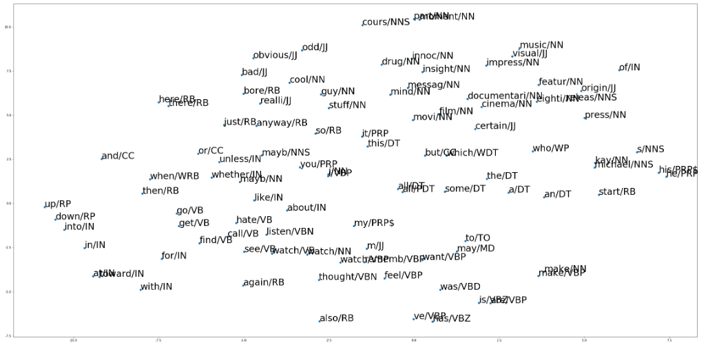
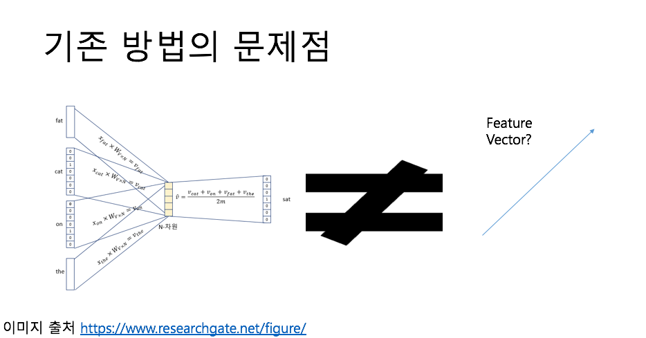
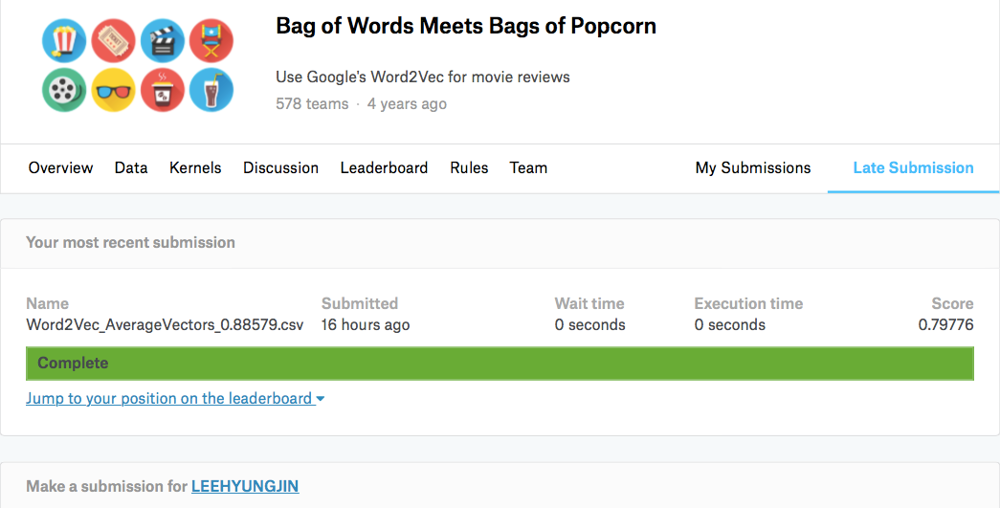

# NLP_Text_Classification_Word2Vec

**캐글 사이트** 에서 다운 받은 positive, negative가 레이블되어 있는 'Kaggle 리뷰' 데이터 말뭉치 2만 5천 건 (https://www.kaggle.com/iarunava/imdb-movie-reviews-dataset) 을 전처리 후 벡터 차원에 임베딩 시킨 후 학습시키고,
**Word2Vec**를 통해 이 모델로 부터 단어 단위로 전처리 된 나머지 'Kaggle 영화 리뷰' 데이터에서의 피쳐를 추출하여 RandomForest 분류기에 넣어서 긍정, 부정을 분류하는 프로젝트

## 1. Model Structure - Word2Vec

      출처 : https://opensource.googleblog.com/2013/08/learning-meaning-behind-words.html

Word2Vec은 분산 된 텍스트 표현을 사용하여 개념 간 유사성을 본다. 
ex) 파리와 프랑스가 베를린과 독일이 (수도와 나라) 같은 방식으로 관련되어 있음을 나타낸다.

실제로 백터차원에 영화 리뷰 말뭉치들 속에 있는 단어들을 임베딩 한 것이다.

## 2. Requirement
- [BeautifulSoup 4](https://www.crummy.com/software/BeautifulSoup/bs4/doc/)
- [nltk](https://datascienceschool.net/view-notebook/118731eec74b4ad3bdd2f89bab077e1b/)
- [gensim](https://radimrehurek.com/gensim/)

## 3. Data Sets

- Training data : Kaggle 리뷰 데이터 말뭉치 2만 5천 건 (https://www.kaggle.com/iarunava/imdb-movie-reviews-dataset)

- Test data : Kaggle 리뷰 데이터 말뭉치 2만 5천 건 (https://www.kaggle.com/iarunava/imdb-movie-reviews-dataset)

= 총 5만 건의 data

## 4. Weight

 태깅된 품사에 따라 피쳐 벡터 값의 가중치를 다르게 곱해주는 방식이며 형용사나 부사가 감성에 대한 정보를 더 많이 담고 있다는 가정에서 출발한 아이디어이다. 현재 영화 리뷰 감성 판별기에 가장 적합한 weight를 고안중이다. 

 가장 적합한 가중치 크기에 대한 가설
 CC	coordinating conjunction 상관 접속사 낮게
 CD	cardinal digit 숫자 서수 중간
 DT	determiner 결정자 중간
 EX	existential there (like: "there is" … think of it like "there exists")  중간
 FW	foreign word 낮게
 IN	preposition/subordinating conjunction 낮게
 JJ	adjective	'big' 높게
 JJR	adjective, comparative	'bigger' 높게
 JJS	adjective, superlative	'biggest' 높게
 LS	list marker	1) 낮게
 MD	modal	could, will 중간
 NN	noun, singular 'desk' 중간
 NNS	noun plural	'desks' 중간
 NNP	proper noun, singular	'Harrison' 낮게
 NNPS	proper noun, plural	'Americans' 낮게
 PDT	predeterminer	'all the kids'  높게
 POS	possessive ending	parent's 낮게
 PRP	personal pronoun	I, he, she 낮게
 PRP$	possessive pronoun	my, his, hers 낮게
 RB	adverb	very, silently, 높게
 RBR	adverb, comparative	better
 RBS	adverb, superlative	best 높게
 RP	particle	give up 중간
 TO	to	go 'to' the store. 중간
 UH	interjection	errrrrrrrm 높게
 VB	verb, base form	take 높게
 VBD	verb, past tense	took 높게
 VBG	verb, gerund/present participle	taking 높게
 VBN	verb, past participle	taken 높게
 VBP	verb, sing. present, non-3d	take 높게
 VBZ	verb, 3rd person sing. present	takes 높게
 WDT	wh-determiner	which 낮게
 WP	wh-pronoun	who, what 낮게
 WP$	possessive wh-pronoun	whose 낮게
 WRB	wh-abverb	where, when 중간

예를 들어, "I/PRP(0.790)", "don't/VB(0.840)", "understand/VB(0.840)", "why(w4)", "many(w5)", "people(w6)", "don't(w7)", "like(w8)", "it(w9)" 에서의 피쳐는 각 9개의 단어의 **(벡터 공간에서의 값 * 품사에 따른 가중치)** 의 합으로 나타내어 진다.

## 5. Result

